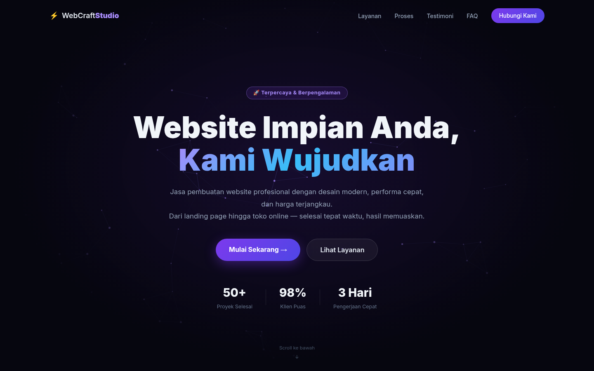
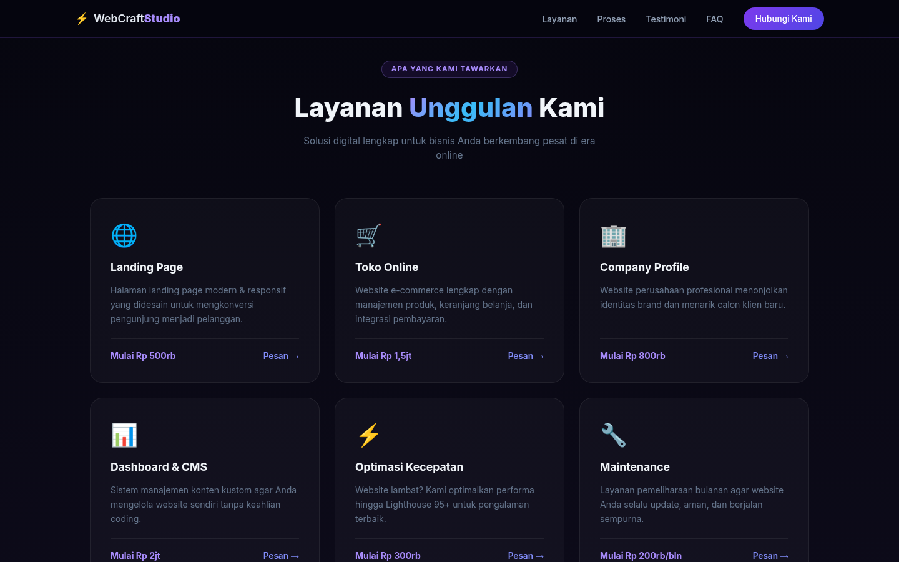
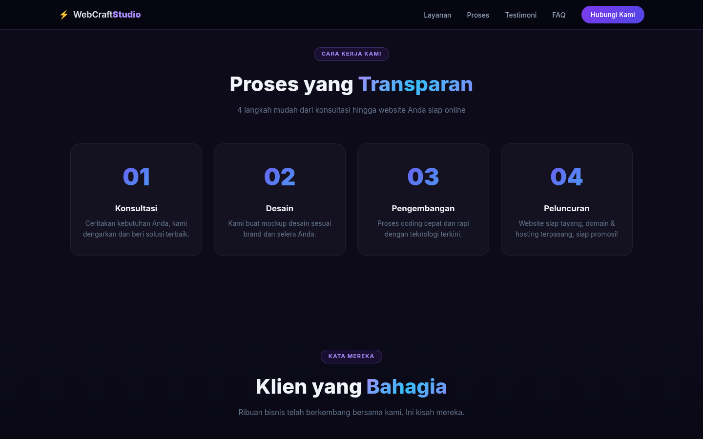
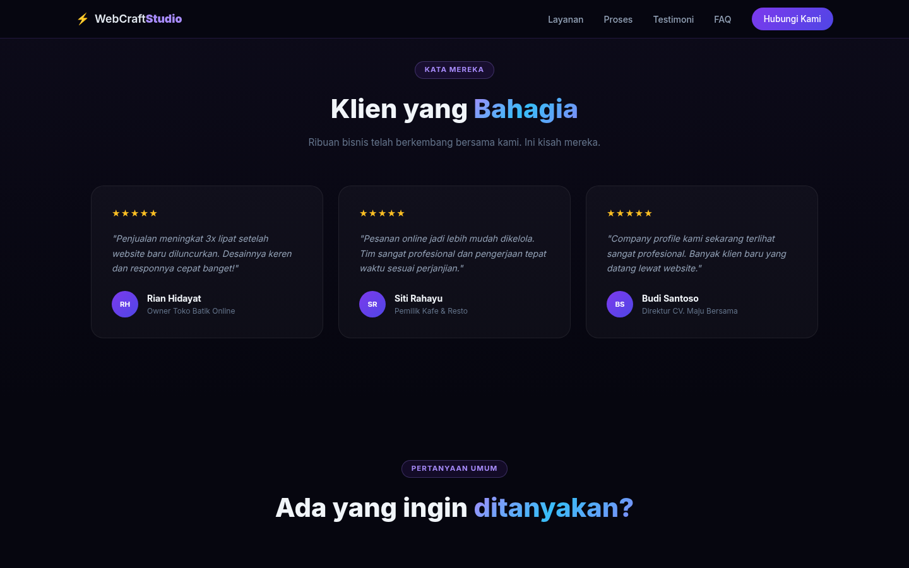
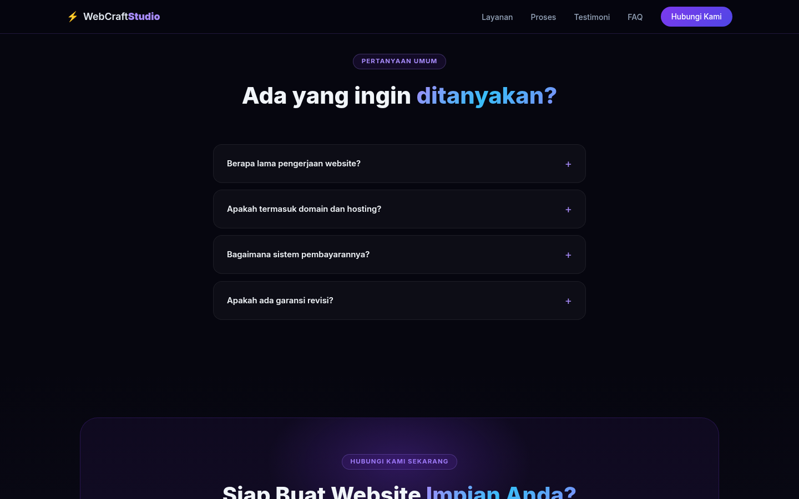
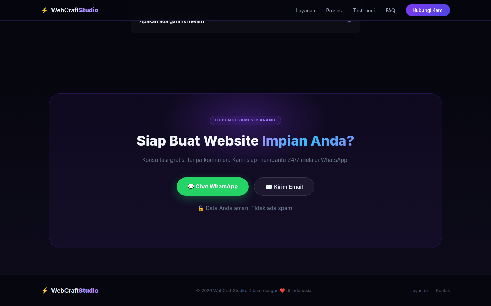

# WebCraftStudio — Landing Page

> 🇮🇩 [Bahasa Indonesia](#bahasa-indonesia) | 🇬🇧 [English](#english)

---

## Screenshots

| Hero | Services |
|------|----------|
|  |  |

| Process | Testimonials |
|---------|--------------|
|  |  |

| FAQ | Contact |
|-----|---------|
|  |  |

---

## Bahasa Indonesia

### Tentang Proyek

**WebCraftStudio** adalah landing page profesional untuk layanan pembuatan website. Dibangun dengan **SvelteKit** dan menggunakan animasi partikel interaktif, performa tinggi (Lighthouse 95+), serta desain modern bertema gelap.

Halaman ini menampilkan:
- 🚀 **Hero** — animasi partikel canvas yang bergerak sinkron dengan mouse, CTA utama, dan statistik layanan
- 🛒 **Layanan** — kartu layanan dengan harga (Landing Page, Toko Online, Company Profile, dll.)
- 🔢 **Proses** — 4 langkah pengerjaan (Konsultasi → Desain → Pengembangan → Peluncuran)
- 💬 **Testimoni** — ulasan nyata dari klien
- ❓ **FAQ** — pertanyaan yang sering ditanyakan dengan accordion interaktif
- 📬 **Kontak** — tombol WhatsApp langsung + formulir kontak
- 🔒 **Mode Maintenance** — toggle bawaan untuk menonaktifkan halaman saat pemeliharaan
- 🚫 **Halaman 404** — halaman error kustom yang elegan

### Teknologi

| Teknologi | Keterangan |
|-----------|------------|
| [SvelteKit](https://kit.svelte.dev/) | Framework utama |
| TypeScript | Bahasa pemrograman |
| Vanilla CSS | Styling, tanpa Tailwind |
| Vercel Adapter | Platform deploy |
| pnpm | Package manager |

### Struktur Proyek

```
Porto/
├── src/
│   ├── routes/
│   │   ├── +layout.svelte      # Layout utama aplikasi
│   │   ├── +page.svelte        # Halaman utama (merakit semua komponen)
│   │   └── +error.svelte       # Halaman 404 kustom
│   └── lib/
│       ├── config.ts           # Konfigurasi situs (nama, WA, email, mode maintenance)
│       ├── data.ts             # Data statis (layanan, langkah, testimoni, FAQ)
│       └── components/
│           ├── Navbar.svelte       # Navigasi atas (transparan → blur saat scroll)
│           ├── Hero.svelte         # Bagian hero + canvas partikel interaktif
│           ├── Services.svelte     # Kartu layanan dengan harga
│           ├── Process.svelte      # Langkah-langkah pengerjaan
│           ├── Testimonials.svelte # Carousel testimoni klien
│           ├── FAQ.svelte          # Accordion FAQ
│           ├── Contact.svelte      # Formulir kontak + tombol WhatsApp
│           ├── Footer.svelte       # Footer dengan tautan navigasi
│           └── Maintenance.svelte  # Halaman mode pemeliharaan
├── static/
│   ├── favicon.svg             # Favicon situs
│   ├── hero-bg.png             # Gambar latar belakang hero
│   ├── robots.txt              # Konfigurasi mesin pencari
│   └── ss-*.png                # Screenshot halaman
├── svelte.config.js            # Konfigurasi SvelteKit + adapter Vercel
├── vite.config.ts              # Konfigurasi Vite
└── package.json                # Dependensi proyek
```

### Cara Menjalankan

**Prasyarat:** Node.js ≥ 18, pnpm

```bash
# 1. Clone repositori
git clone <url-repo> Porto
cd Porto

# 2. Install dependensi
pnpm install

# 3. Jalankan server development
pnpm run dev

# Buka http://localhost:5173
```

### Build Produksi

```bash
pnpm run build
pnpm run preview   # Preview hasil build
```

### Konfigurasi

Edit file `src/lib/config.ts` untuk mengubah informasi situs:

```typescript
export const MAINTENANCE_MODE = false; // Ubah ke true untuk mode pemeliharaan

export const SITE = {
  name: 'WebCraftStudio',
  tagline: 'Jasa Pembuatan Website Profesional Indonesia',
  description: '...',
  url: 'https://webcraft.id',
  whatsapp: '6281234567890',   // Nomor WA tanpa "+"
  email: 'hello@webcraft.id'
};
```

Edit file `src/lib/data.ts` untuk mengubah konten:
- `services` — daftar layanan & harga
- `steps` — langkah-langkah proses pengerjaan
- `testimonials` — ulasan klien
- `faqs` — daftar FAQ

### Mode Pemeliharaan

Untuk mengaktifkan halaman pemeliharaan, set `MAINTENANCE_MODE = true` di `src/lib/config.ts`. Pengunjung akan melihat halaman khusus dan tidak dapat mengakses konten utama.

### SEO

Halaman ini sudah dioptimasi untuk SEO:
- Meta tag lengkap (title, description, keywords)
- Open Graph & Twitter Card
- Schema.org JSON-LD (ProfessionalService)
- Canonical URL
- `robots.txt`
- Struktur heading yang benar (H1 tunggal per halaman)

### Deploy ke Vercel

```bash
# Install Vercel CLI (jika belum)
npm i -g vercel

# Deploy
vercel
```

Proyek ini sudah dikonfigurasi dengan `@sveltejs/adapter-vercel`.

---

## English

### About the Project

**WebCraftStudio** is a professional landing page for web development services. Built with **SvelteKit**, it features an interactive particle animation, high performance (Lighthouse 95+), and a modern dark-themed design.

The page includes:
- 🚀 **Hero** — mouse-synced canvas particle animation, primary CTA, and service stats
- 🛒 **Services** — service cards with pricing (Landing Page, Online Store, Company Profile, etc.)
- 🔢 **Process** — 4-step workflow (Consultation → Design → Development → Launch)
- 💬 **Testimonials** — real client reviews
- ❓ **FAQ** — frequently asked questions with an interactive accordion
- 📬 **Contact** — direct WhatsApp button + contact form
- 🔒 **Maintenance Mode** — built-in toggle to disable the site during maintenance
- 🚫 **404 Page** — elegant custom error page

### Tech Stack

| Technology | Purpose |
|------------|---------|
| [SvelteKit](https://kit.svelte.dev/) | Primary framework |
| TypeScript | Programming language |
| Vanilla CSS | Styling (no Tailwind) |
| Vercel Adapter | Deployment platform |
| pnpm | Package manager |

### Project Structure

```
Porto/
├── src/
│   ├── routes/
│   │   ├── +layout.svelte      # App layout wrapper
│   │   ├── +page.svelte        # Main page (assembles all components)
│   │   └── +error.svelte       # Custom 404 error page
│   └── lib/
│       ├── config.ts           # Site config (name, WA number, email, maintenance mode)
│       ├── data.ts             # Static data (services, steps, testimonials, FAQs)
│       └── components/
│           ├── Navbar.svelte       # Top nav (transparent → blurred on scroll)
│           ├── Hero.svelte         # Hero section + interactive particle canvas
│           ├── Services.svelte     # Service cards with pricing
│           ├── Process.svelte      # Step-by-step workflow
│           ├── Testimonials.svelte # Client testimonial carousel
│           ├── FAQ.svelte          # FAQ accordion
│           ├── Contact.svelte      # Contact form + WhatsApp button
│           ├── Footer.svelte       # Footer with nav links
│           └── Maintenance.svelte  # Maintenance mode screen
├── static/
│   ├── favicon.svg             # Site favicon
│   ├── hero-bg.png             # Hero background image
│   ├── robots.txt              # Search engine config
│   └── ss-*.png                # Page screenshots
├── svelte.config.js            # SvelteKit + Vercel adapter config
├── vite.config.ts              # Vite configuration
└── package.json                # Project dependencies
```

### Getting Started

**Prerequisites:** Node.js ≥ 18, pnpm

```bash
# 1. Clone the repository
git clone <repo-url> Porto
cd Porto

# 2. Install dependencies
pnpm install

# 3. Start the development server
pnpm run dev

# Open http://localhost:5173
```

### Production Build

```bash
pnpm run build
pnpm run preview   # Preview the build locally
```

### Configuration

Edit `src/lib/config.ts` to change site settings:

```typescript
export const MAINTENANCE_MODE = false; // Set to true to enable maintenance mode

export const SITE = {
  name: 'WebCraftStudio',
  tagline: 'Professional Website Development Services',
  description: '...',
  url: 'https://webcraft.id',
  whatsapp: '6281234567890',   // WA number without "+"
  email: 'hello@webcraft.id'
};
```

Edit `src/lib/data.ts` to change content:
- `services` — service list & pricing
- `steps` — workflow steps
- `testimonials` — client reviews
- `faqs` — FAQ items

### Maintenance Mode

To enable the maintenance page, set `MAINTENANCE_MODE = true` in `src/lib/config.ts`. Visitors will see a dedicated placeholder screen instead of the main content.

### SEO

This page is fully SEO-optimized:
- Complete meta tags (title, description, keywords)
- Open Graph & Twitter Card
- Schema.org JSON-LD (ProfessionalService)
- Canonical URL
- `robots.txt`
- Correct heading hierarchy (single H1 per page)

### Deploy to Vercel

```bash
# Install Vercel CLI (if not already installed)
npm i -g vercel

# Deploy
vercel
```

The project is pre-configured with `@sveltejs/adapter-vercel`.

### Performance Features

- **Particle canvas**: 90 particles with mouse-proximity interaction, optimized with `requestAnimationFrame`, `ResizeObserver`, and `will-change`
- **Intersection Observer**: Sections animate in when they scroll into view (`.reveal` class)
- **Reduced motion**: Respects `prefers-reduced-motion` — disables all animations for accessibility
- **DPR-aware canvas**: Canvas is scaled for retina/HiDPI screens automatically
- **Passive event listeners**: All scroll/touch handlers use `{ passive: true }` for smooth performance

---

*Made with ❤️ — WebCraftStudio*
